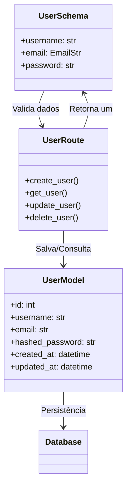
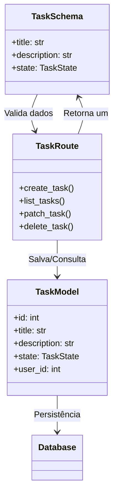
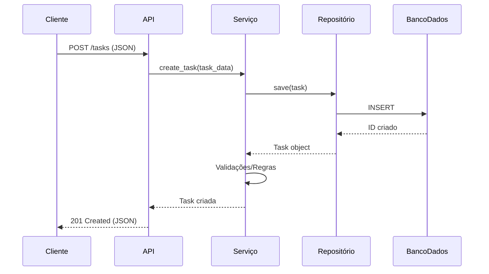

# **Task Manager API**  


## **📌 Visão Geral**  
Este projeto consiste em uma **API RESTful** para um sistema de gestão de tarefas colaborativas, desenvolvida em **Python com FastAPI**. A aplicação permite que usuários criem, editem, atribuam e concluam tarefas, seguindo uma arquitetura **MVC (Model-View-Controller)** com camadas bem definidas para garantir **modularidade, desacoplamento e testabilidade**.  

---

## **📋 Funcionalidades**  
✔ **CRUD de Usuários** (Criar, Ler, Atualizar, Deletar)   
✔ **CRUD de Tarefas** (Criar, Ler, Atualizar, Deletar)  
✔ **Atribuição de Tarefas**   
✔ **Autenticação JWT** (JSON Web Tokens)  
✔ **Logs Estruturados** (com Uvicorn e loguru)  
✔ **Documentação Automatizada** (Swagger/OpenAPI)  
✔ **Testes Automatizados** (Unitários e de Integração, com pytest e ruff)  
✔ **Formatação de código automático** (formatação por padrões com ruff)  

---

## **🛠️ Arquitetura (MVC)**  
A API foi desenvolvida seguindo o padrão **MVC (Model-View-Controller)**, com as seguintes camadas:  

| Camada          | Descrição                                                                 | Exemplo de Componentes                          |  
|----------------|-------------------------------------------------------------------------|-----------------------------------------------|  
| **Model**      | Gerencia os dados e a lógica de negócio.                                | `Task`, `User`              |  
| **View**       | Responsável pela apresentação dos dados (JSON na API REST).             | FastAPI `Response`          |  
| **Controller** | Intermediário entre Model e View, lidando com requisições HTTP.        | FastAPI `Router`, `Security`, `Settings`            |

---

## **📊 Diagramas da Arquitetura** *(Espaço para inserir os diagramas gerados)*  

### **1. Diagrama de Componentes**  
**User**

**Task**


### **2. Diagrama de Sequência (Fluxo de Criação de Usuário)**


### **3. Diagrama de Banco de dados**
```mermaid
erDiagram
    USER {
        int id PK
        string username
        string email
        string password
        datetime created_at
        datetime updated_at
        int id_task FK
    }
    TASK {
        int id PK
        string title
        string description
        string state
        int user_id FK
    }

    USER ||--o{ TASK : "assignee"
 ```

## **⚙️ Configuração e Execução**  

### **Pré-requisitos**  
- Python 3.13+  
- Docker
- Poetry (gerenciamento de dependências)  

### **Instalação**  
Para a instalação será necessário ter o [docker](https://docs.docker.com/get-started/get-docker/)


Com o docker instalado faremos o seguinte:
```bash
# Clone o repositório
git clone https://github.com/Nicknamedlc/crud-task-api.git

# Instale as dependências
pip install poetry

poetry install crud-task-api

# Execute o comando para criar um docker a partir da dockerfile e da compose.yaml
docker-compose up --build # Na primeira execução
docker-compose up # Nas execuções posteriores
```

### **Acesse a Documentação**  
- **Swagger UI:** `http://localhost:8000/docs` (após executar o docker-compose up)


## **🧪 Testes**  
```bash
# Execute testes unitários
pytest tests/unit

# Execute testes de integração
pytest tests/integration

# com o uso do poetry
Poetry run task test 

# Ou
poetry shell
task test
```

## **</> Autoformatação**  
```bash
# Para verificação automática de problemas de formatação no código
poetry run task lint 

# Para correção automática
poetry run task format
```
---

## **📝 Padrões e Boas Práticas**  
✅ **Repository Pattern** (Separação clara entre lógica de negócio e acesso a dados)  
✅ **Injeção de Dependência** (Para melhor testabilidade)  
✅ **Logs Estruturados** (Facilitando monitoramento)  
✅ **Documentação Automatizada** (OpenAPI/Swagger)  

---

## **🔗 Vídeo Exemplo**
`https://drive.google.com/file/d/1p_sAB3nEtpJZXdOkljzRCBpYwHkR-JIB/view`

---

## **🔧 Como Testar os Endpoints**

1. Acesse a documentação interativa:
   ```
   http://localhost:8000/docs
   ```

2. Autentique-se primeiro via endpoint `/auth/login`

3. Use os exemplos de requisição fornecidos no Swagger UI
